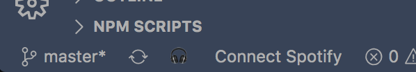
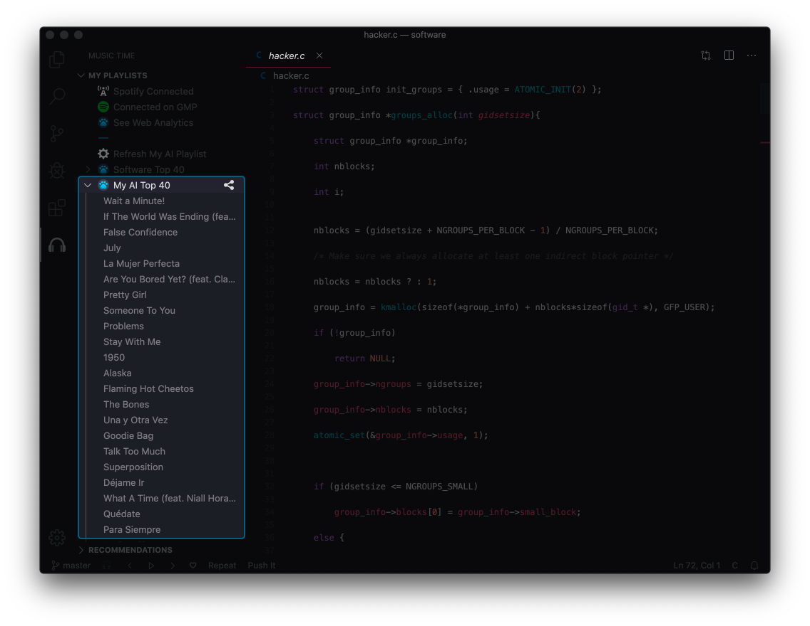
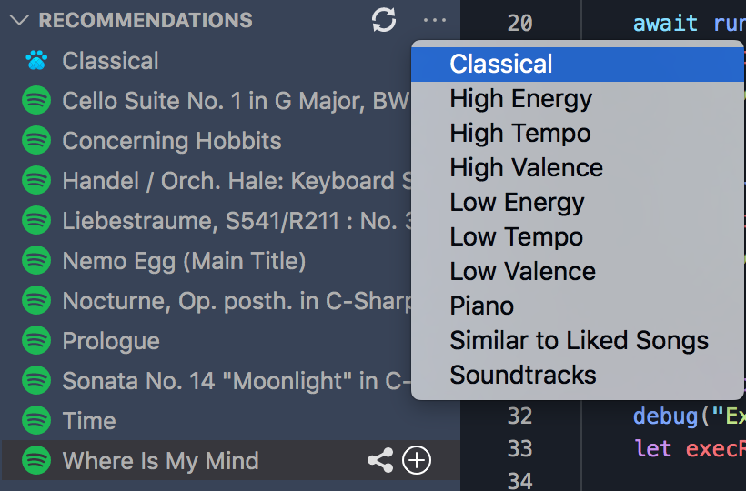
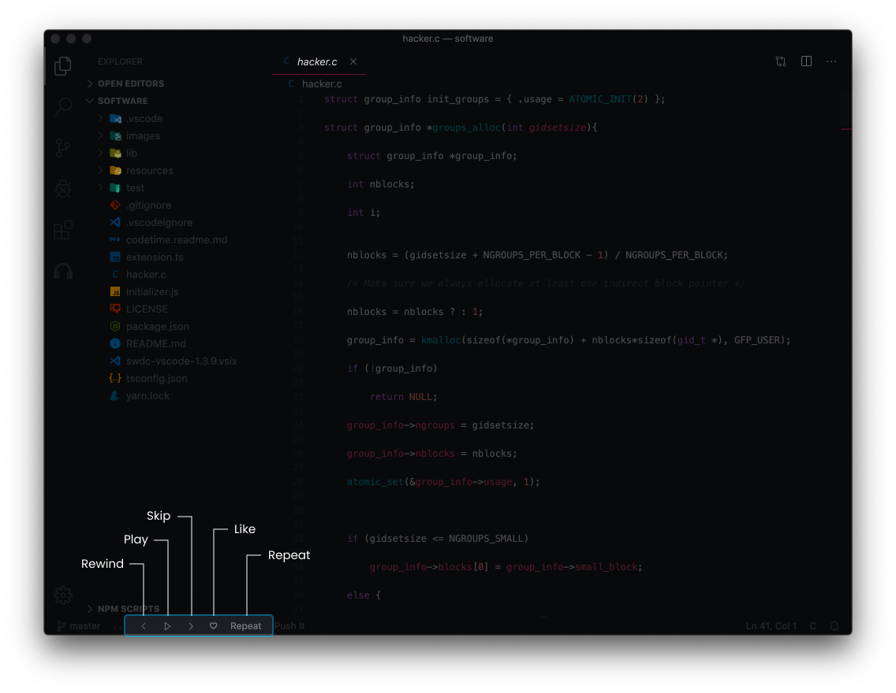
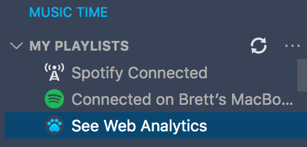
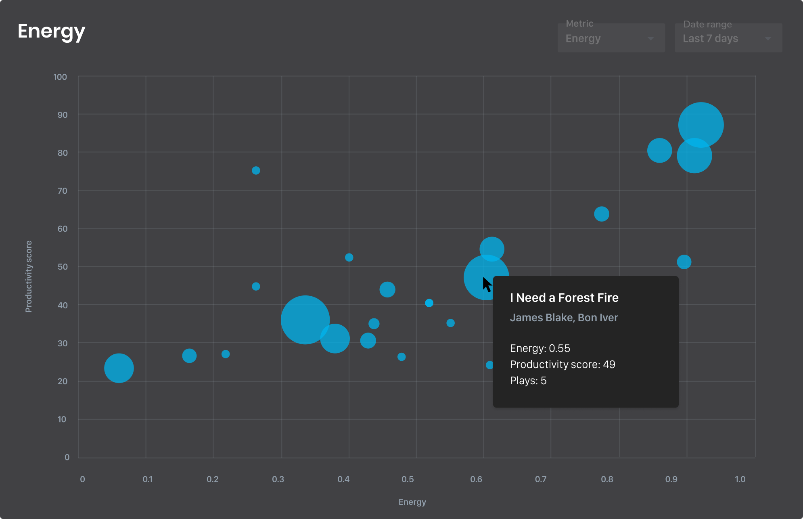
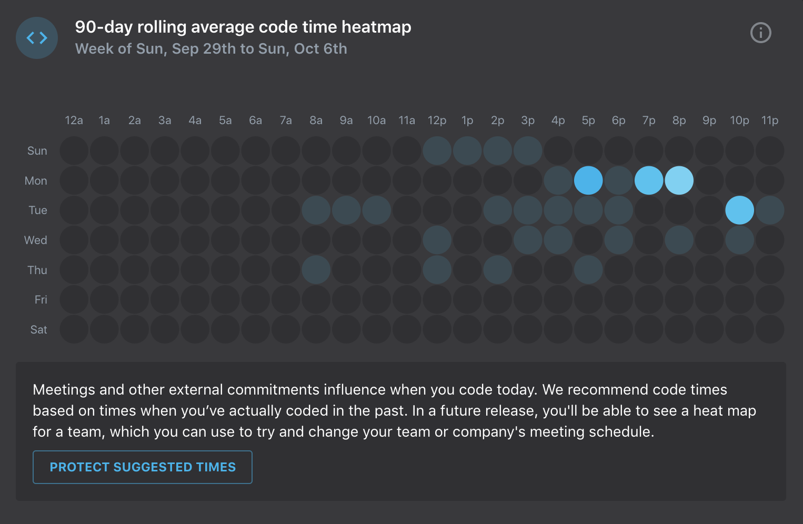
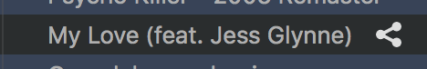

<!--   
 -->

# Music Time for Visual Studio Code

A VS Code extension to discover the most productive music to listen to as you code

  

## Features

**Integrated player controls**: Control your music right from the status bar of your editor.

**Embedded playlists**: Browse and play your Spotify and iTunes playlists and songs from your editor.

**AI playlists**: Get a personalized AI playlist generated using deep learning to help you focus.

**Metrics profile**: Learn how the underlying metrics of music (including tempo, loudness, speechiness, energy, and valence) impact how you code.

**Personal top 40**: See your most productive songs, artists, and genres every week in your weekly top 40.

**Weekly music dashboard**: See your top songs, artists, and genres each week by productivity score and plays while coding.

**Global top 40**: Discover new music from developers around the world in our Software Top 40 playlist.

**Slack integration**: Connect Slack to share songs and playlists in channels in your workspace.

Music Time currently supports Spotify. We will support iTunes and other players in a future release. You can also check out the [cody-music](https://www.npmjs.com/package/cody-music) NPM for more information about how this extension works.

## Getting started

### **1. Connect your Spotify account**

Click the **Connect Spotify** button in the status bar or in the playlist tree, which will prompt you to log in to your Spotify account.

  

### **2. Control your music and playlists right from your editor**

Click on any song in your list of playlists. Music Time will prompt you to open a Spotify player—either the desktop app or web player.

    Music Time requires a premium Spotify account and an internet connection to control your music on Windows and Linux. If you are on a Mac, Music Time can also control the Spotify desktop app using AppleScript as either a premium or non-premium user.

### **3. Generate your personal playlist**

Click the **Generate AI Playlist** button to get a personalized AI playlist generated using deep learning. Your playlist improves as you listen to more music.

  

### **4. Try a song recommendation**

Find songs similar to your listening history. Try high tempo, high energy, and high valence songs for upbeat work or Classical or Piano for slower, more complex coding. Add a song to a playlist using the "+" button.

  

### **5. Like a song**

Like a song from the status bar by pressing the "♡" button, which helps us improve your song recommendations and adds that song to your Liked Songs playlist on Spotify.

  

### **6. Check out the Software Top 40**

Discover new music from developers around the world in a playlist generated by our algorithms. The Software Top 40 playlist is refreshed every week.

## Find your most productive music

As you listen to music while you code, we calculate a productivity score by combining your coding metrics with your listening history and data from over 10,000 developers.

Here are the different ways you can discover your most productive music.

### **1. View your web analytics**

Click on the “See Web Analytics” button to see your most productive songs, artists, and genres by productivity score. You can also visit app.software.com/login and use your Spotify email address to log in.

  

### **2. Open your Music Time dashboard**

Click the “🎧” icon in the status bar then **Music Time Dashboard** to generate an in-editor report of your top songs, artists, and genres by productivity score.

  

### **3. Explore your music metrics**

Discover how the underlying [metrics of music](app.software.com/music/metrics) (including tempo, loudness, speechiness, energy, and valence) impact how you code.

  

### **4. Visualize your Code Time metrics**

Music Time captures the same data as our [Code Time plugin](https://github.com/swdotcom/swdc-vscode), such as your keystrokes, time by file and project, and lines of code. This data is used to calculate your productivity scores. You can also [visit your feed](app.software.com) to see simple visualizations of your Code Time data, such as a rolling heatmap of your top programming times by hour of the day.

  

## Share your top songs

Share your top songs on Facebook, Twitter, WhatsApp, and Tumblr by clicking on the share icon next to a song in the playlist tree. You can also Connect Slack to share songs with your team.

  

Connecting Slack requires team member permissions or above. You will not be able to connect Slack as a single or multi-channel guest.

## Contributing & Feedback

Enjoying Music Time? Tweet at us (@softwaretop40) and follow us on Instagram (@softwaretop40).

You can open an issue on a GitHub page or contact us at [support@software.com](mailto:support@software.com) with any additional questions or feedback.
